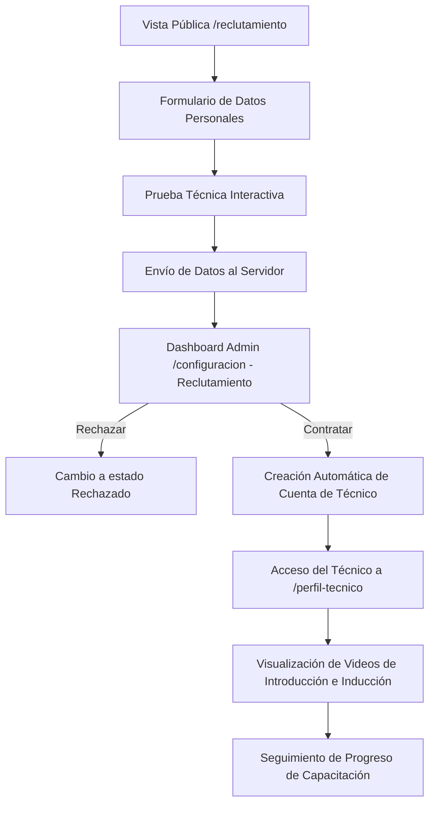

# Plan de Implementación: Sistema de Reclutamiento y Capacitación de Técnicos

Este plan detalla el diseño e implementación de un flujo completo para el reclutamiento, evaluación, contratación e inducción de nuevos técnicos.

## Resumen del Flujo

---

## Cambios Propuestos

### 1. Base de Datos (Backend)

#### [NEW] [create_reclutamiento_tables.py](file:///c:/Users/mauro/Desktop/Mauro/crm_tsnetwork/backend/create_reclutamiento_tables.py)
Creación de un script en Python para inicializar las siguientes tablas en la base de datos MySQL:
*   **`postulaciones_tecnicos`**: Almacena el nombre, email, teléfono, dirección, experiencia, respuestas del examen en formato JSON, fecha de postulación, estado ('pendiente', 'aprobado', 'rechazado') y comentarios de la evaluación.
*   **`tecnicos_videos_vistos`**: Almacena la relación de qué técnico (vinculado a `auth.id`) ha visto qué video introductorio para rastrear su progreso.

---

### 2. Endpoints (Backend - Flask)

#### [MODIFY] [app.py](file:///c:/Users/mauro/Desktop/Mauro/crm_tsnetwork/backend/app.py)
Agregar las siguientes rutas de API:
*   `POST /api/reclutamiento/postular` [Público]: Recibe los datos personales del postulante y sus respuestas a la prueba técnica, insertando un registro en `postulaciones_tecnicos`.
*   `GET /api/reclutamiento/postulaciones` [Protegido - Admin/Superadmin/Moderador]: Lista todas las postulaciones recibidas.
*   `POST /api/reclutamiento/postulaciones/<int:id>/evaluar` [Protegido - Admin/Superadmin]: Permite aprobar o rechazar la postulación. Si se aprueba, crea automáticamente un registro en la tabla `auth` con el rol `'tecnico'` utilizando las credenciales proporcionadas.
*   `GET /api/tecnico/videos-vistos` [Protegido - Tecnico]: Obtiene la lista de IDs de videos que el técnico en sesión ha marcado como vistos.
*   `POST /api/tecnico/marcar-video-visto` [Protegido - Tecnico]: Marca un video introductorio como visto por el técnico actual.

---

### 3. Interfaz de Usuario (Frontend)

#### [NEW] [Reclutamiento.tsx](file:///c:/Users/mauro/Desktop/Mauro/crm_tsnetwork/frontend/src/pages/Reclutamiento.tsx)
Crear la vista pública para postulantes. 
*   **Diseño**: Estilo futurista y elegante, coherente con la pantalla de inicio de sesión actual (fondos oscuros, bordes brillantes en color naranja de TS Network, animaciones sutiles).
*   **Sección 1**: Formulario de registro (Nombre completo, Email, Teléfono, Dirección, Experiencia previa).
*   **Sección 2**: Prueba de Selección Técnica. Preguntas de opción múltiple y desarrollo sobre redes, cableado estructurado y CCTV (cámaras de seguridad/NVR).
*   **Sección 3**: Estado de éxito al terminar de enviar la postulación.

#### [NEW] [PerfilTecnico.tsx](file:///c:/Users/mauro/Desktop/Mauro/crm_tsnetwork/frontend/src/pages/PerfilTecnico.tsx)
Crear el perfil de inducción para técnicos contratados.
*   Muestra los datos de perfil del técnico logueado.
*   Presenta una lista estructurada de **Videos Introductorios/Capacitación** (CCTV, estándares de cableado, configuración de equipos y atención al cliente).
*   Incorpora un reproductor interactivo y un botón para **Marcar como visto**. El progreso se actualiza dinámicamente y se muestra en una barra de progreso.

#### [MODIFY] [Configuracion.tsx](file:///c:/Users/mauro/Desktop/Mauro/crm_tsnetwork/frontend/src/pages/Configuracion.tsx)
Agregar una pestaña nueva llamada **"Reclutamiento"** visible para administradores y superadmins:
*   Muestra un listado ordenado de postulantes técnicos.
*   Permite hacer clic en cada postulante para ver el desglose de sus datos y las respuestas a su prueba.
*   Proporciona controles para **Rechazar** o **Contratar** (abriendo un formulario modal para ingresar el usuario y contraseña del nuevo técnico y ejecutar la creación de su cuenta).

#### [MODIFY] [main.tsx](file:///c:/Users/mauro/Desktop/Mauro/crm_tsnetwork/frontend/src/main.tsx)
Registrar las nuevas rutas en el enrutador de React:
*   `/reclutamiento` (Ruta pública abierta a todo el mundo).
*   `/perfil-tecnico` (Ruta protegida para el rol `tecnico` y administradores/superadmins).

#### [MODIFY] [Layout.tsx](file:///c:/Users/mauro/Desktop/Mauro/crm_tsnetwork/frontend/src/components/Layout.tsx)
Hacer que el nombre y rol del usuario en la parte superior derecha de la cabecera sea interactivo. Si el rol es `tecnico`, al hacer clic en él se redirigirá a `/perfil-tecnico`.

#### [MODIFY] [Inicio.tsx](file:///c:/Users/mauro/Desktop/Mauro/crm_tsnetwork/frontend/src/pages/Inicio.tsx)
Si el rol del usuario logueado es `tecnico`, mostrar un banner superior amigable con un enlace llamativo para acceder a su capacitación:
> 🎬 **¡Bienvenido a TS Network!** Completa tu proceso de inducción viendo los videos introductorios en tu [Perfil de Técnico](/perfil-tecnico).

---

## Plan de Verificación

### Pruebas Manuales
1.  **Registro de Postulante**: Acceder a `/reclutamiento` de forma pública (sin haber iniciado sesión), rellenar el formulario de datos, completar la prueba técnica de red/CCTV y enviarla. Verificar que se muestre la confirmación.
2.  **Verificación de Pruebas**: Iniciar sesión como `administrador` o `superadmin`, ir a `/configuracion`, seleccionar la pestaña "Reclutamiento", y verificar que la postulación aparezca con sus respuestas correspondientes.
3.  **Contratación**: Evaluar la postulación como aprobada y crear un nuevo usuario con rol de `tecnico`.
4.  **Perfil e Inducción**: Iniciar sesión con la cuenta de técnico recién creada. Verificar que no se muestre el menú lateral general, que se muestre el banner de bienvenida en la página de inicio, y que al acceder a `/perfil-tecnico` se cargue correctamente su información de perfil, los videos introductorios y el control de progreso de reproducción de videos.
